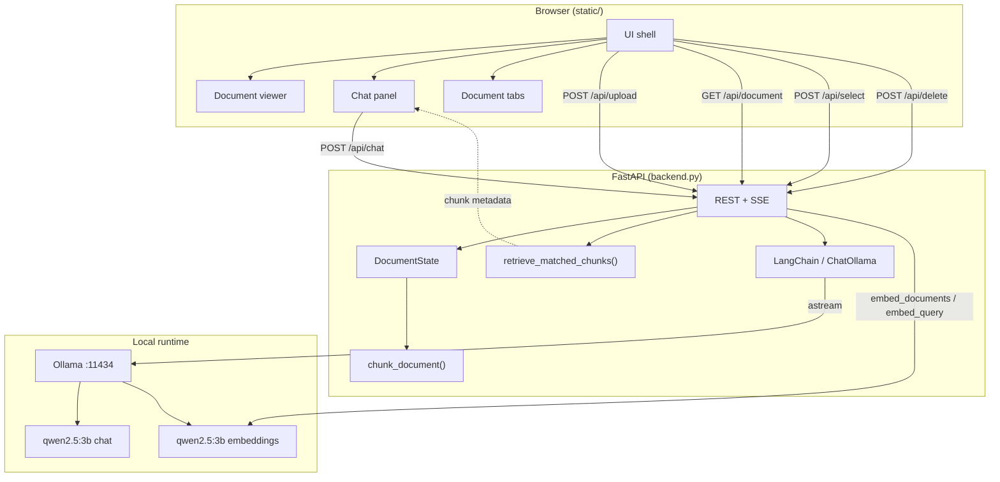
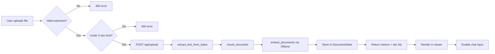
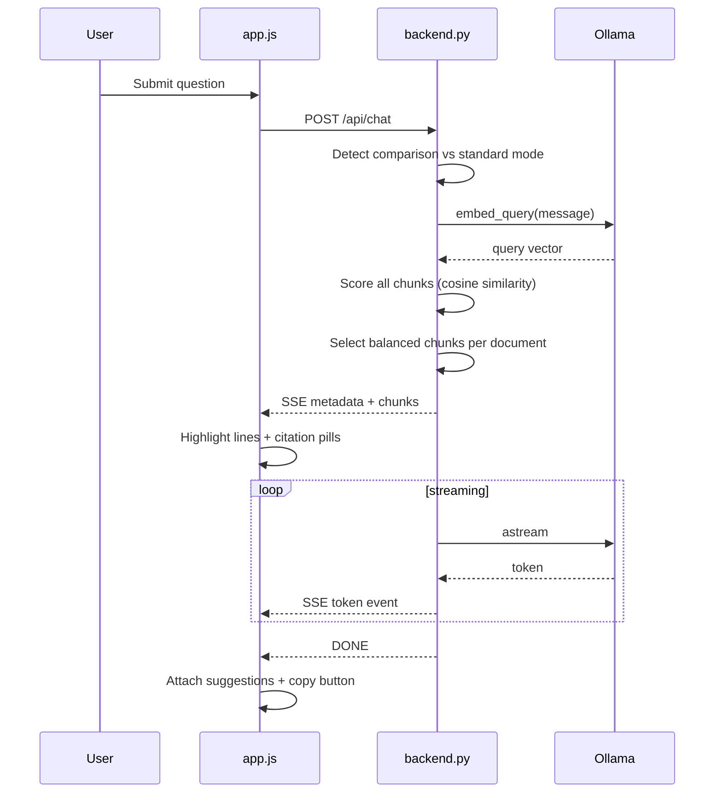
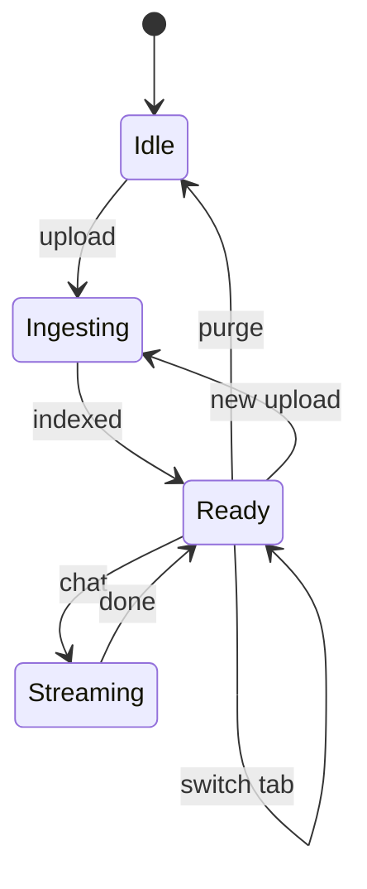
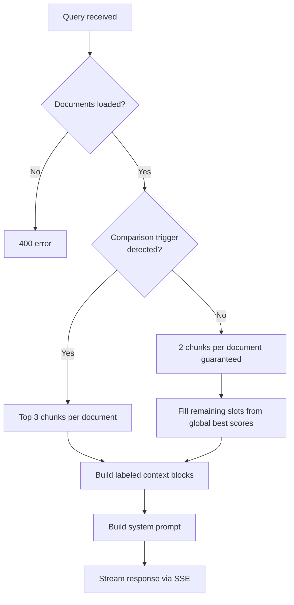
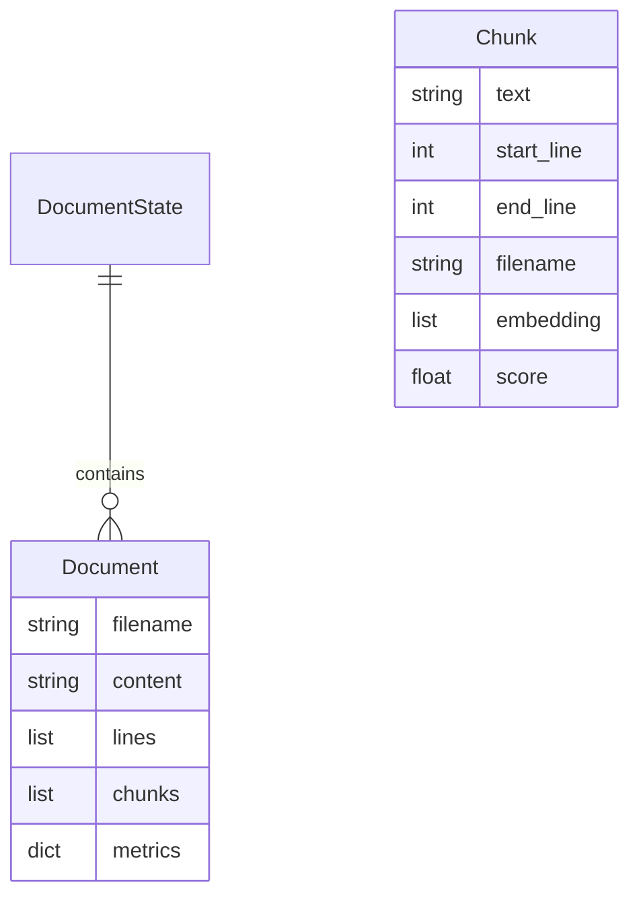
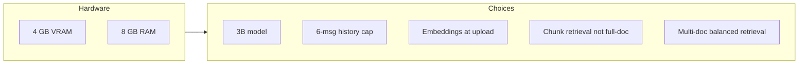
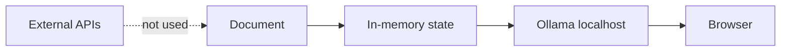

# Local-Cortex

Local document Q&A tool. Upload one or more files, ask questions, and get answers grounded in your documents with line-level citations. Inference runs through Ollama on your machine — no external API calls.

[](LICENSE)
[](https://www.python.org/)
[](https://fastapi.tiangolo.com/)

**Branch:** `features` (multi-document web UI)  
**Repo:** [Garvit-821/Local-ollama-powered-ai-assisted-doc-analyzer](https://github.com/Garvit-821/Local-ollama-powered-ai-assisted-doc-analyzer)

---

## Table of Contents

- [Overview](#overview)
- [Features](#features)
- [Architecture](#architecture)
- [Tech Stack](#tech-stack)
- [Project Structure](#project-structure)
- [Setup and Installation](#setup-and-installation)
- [Usage](#usage)
- [Configuration](#configuration)
- [API Reference](#api-reference)
- [Interface Versions](#interface-versions)
- [Hardware Notes](#hardware-notes)
- [Privacy](#privacy)
- [Trade-offs and Limitations](#trade-offs-and-limitations)
- [Roadmap](#roadmap)
- [Contributing](#contributing)
- [Acknowledgments](#acknowledgments)
- [License](#license)

---

## Overview

Local-Cortex started as a command-line document chatbot (`app.py`), went through a Streamlit prototype (`app_ui.py`), and now ships a FastAPI + vanilla JS web application (`backend.py` + `static/`). The `features` branch is the current recommended version: multi-document upload, embedding-based retrieval, SSE streaming, and line-level citations.

The backend keeps uploaded documents in memory, chunks them with line traceability, generates per-chunk embeddings via Ollama, and retrieves relevant sections using cosine similarity. For comparison-style queries, retrieval switches to a full-scan mode that guarantees coverage across every loaded file. Responses stream back over Server-Sent Events. The frontend highlights source lines and renders clickable citation badges for each answer.

| | |
|---|---|
| Inference | Ollama on `localhost:11434` |
| Retrieval | Ollama embeddings + cosine similarity |
| Default model | `qwen2.5:3b` (chat and embeddings) |
| Multi-document | Up to 5 files per session |
| Target hardware | ~4 GB VRAM GPU, 8 GB RAM |
| Persistence | None — state clears on server restart |

---

## Features

| | What it does |
|---|---|
| File upload | `.txt`, `.md`, `.pdf`, `.docx` via drag-and-drop or file browser |
| Multi-document | Load up to 5 files; tab bar, context banner, per-file delete |
| Retrieval | Embedding search with balanced per-document chunk selection |
| Comparison mode | Keywords like `compare`, `versus`, `both documents` trigger top-3-per-file retrieval |
| Chat | SSE token streaming with thinking/streaming session states |
| Citations | `filename: L12–45` badges; click to jump to cited lines (switches active doc if needed) |
| Follow-ups | Model appends two suggested questions per reply (parsed into clickable buttons) |
| Search | Client-side filter over document lines (minimum 2 characters) |
| Export | Download full chat history as Markdown |
| Session reset | Clear button purges all documents and chat history |
| Telemetry | Live metrics: active document, lines, words, session state |

### Document ingestion

- Text extraction via `pypdf` (PDF) and `python-docx` (Word)
- Line-preserving chunking (~1000 characters per chunk, 200-character overlap)
- Per-chunk embedding generation through Ollama at upload time
- Document metrics: character count, word count, line count, chunk count

### Chat interface

- Copy-to-clipboard on assistant messages
- Cinematic upload progress with staged ingestion log
- Ambient particle background and document scan animation

---

## Architecture

### System overview



### Upload flow



### Chat flow



### Session state



### Context selection (retrieval)



### Multi-document data model



`DocumentState` is a module-level singleton. Restarting the server clears all uploaded documents.

### Component responsibilities

| Component | File | Role |
|-----------|------|------|
| Web UI | `static/index.html`, `static/styles.css`, `static/app.js` | Split-screen cockpit, upload modal, chat, citations |
| API server | `backend.py` | Upload, retrieval, chat streaming, static file hosting |
| CLI | `app.py` | Terminal-based single-document chat |
| Streamlit UI | `app_ui.py` | Alternative browser UI via Streamlit |
| Design tokens | `DESIGN.md` | UI color and typography reference (not loaded at runtime) |

---

## Tech Stack

| Layer | Tool |
|-------|------|
| Backend | Python 3.10+, FastAPI, Uvicorn |
| LLM | Ollama + `qwen2.5:3b` |
| Embeddings | OllamaEmbeddings + `qwen2.5:3b` |
| Orchestration | LangChain (`langchain-ollama`, `langchain-core`) |
| Similarity | Custom cosine similarity (`math`) |
| PDF | `pypdf` |
| DOCX | `python-docx` |
| Frontend | HTML, CSS, JS (no build step) |
| Fonts | Inter, JetBrains Mono (Google Fonts CDN) |
| Icons | Font Awesome 6 (CDN) |

Older entry points still in the repo: `app.py` (CLI), `app_ui.py` (Streamlit).

Note: `SimpleTFIDF` is defined in `backend.py` but is not used in the `features` branch retrieval path.

---

## Project Structure

```
Local-ollama-powered-ai-assisted-doc-analyzer/
├── backend.py          # API, chunking, embeddings, retrieval, SSE chat
├── static/
│   ├── index.html      # Main web interface
│   ├── app.js          # Client logic, SSE, UI state
│   └── styles.css      # Layout and visual design
├── DESIGN.md           # UI design tokens
├── app.py              # CLI version (single document)
├── app_ui.py           # Streamlit version (single document)
├── sample_doc.txt      # Sample file for CLI demo
├── test_pricing.txt    # Sample pricing document
├── test_sample.md      # Sample markdown file
├── test_sample.docx    # Sample Word document
├── LICENSE             # MIT License
└── README.md
```

---

## Setup and Installation

### Requirements

| | Minimum | Recommended |
|---|---|---|
| Python | 3.10 | 3.12 |
| RAM | 8 GB | 16 GB |
| GPU | Not required | NVIDIA with 4 GB+ VRAM |
| Disk | ~3 GB free | For Ollama model + venv |
| OS | Linux, macOS, Windows 10/11 | |

You also need [Ollama](https://ollama.com) installed and running before chat will work. The web UI loads without it, but inference will fail until Ollama is up.

---

### Step 1 — Install Ollama

Pick your platform and run the commands below.

#### Linux (Ubuntu / Debian)

```bash
curl -fsSL https://ollama.com/install.sh | sh
```

#### macOS

```bash
curl -fsSL https://ollama.com/install.sh | sh
```

Or download the `.dmg` installer from https://ollama.com/download

Or via Homebrew:

```bash
brew install ollama
```

#### Windows (PowerShell)

Download and run the installer from https://ollama.com/download

After install, open a new terminal and confirm Ollama is available:

```powershell
ollama --version
```

---

### Step 2 — Pull the default model

This downloads `qwen2.5:3b` (~2 GB). Run once.

```bash
ollama pull qwen2.5:3b
```

Verify it is listed:

```bash
ollama list
```

Start the Ollama service if it is not already running:

```bash
# Linux / macOS — usually starts automatically after install
ollama serve
```

On Windows, Ollama runs as a background app after installation. Check the system tray for the Ollama icon.

---

### Step 3 — Clone the repository

```bash
git clone https://github.com/Garvit-821/Local-ollama-powered-ai-assisted-doc-analyzer.git
cd Local-ollama-powered-ai-assisted-doc-analyzer
git checkout features
```

---

### Step 4 — Create a virtual environment

#### Linux / macOS

```bash
python3 -m venv venv
source venv/bin/activate
```

#### Windows (PowerShell)

```powershell
python -m venv venv
.\venv\Scripts\Activate.ps1
```

#### Windows (Command Prompt)

```cmd
python -m venv venv
venv\Scripts\activate.bat
```

Your prompt should show `(venv)` when the environment is active.

---

### Step 5 — Install Python dependencies

Run this inside the activated virtual environment:

```bash
pip install --upgrade pip

pip install langchain-ollama langchain-core fastapi uvicorn python-multipart python-docx pypdf pydantic
```

Optional — only if you want to run the older Streamlit UI (`app_ui.py`):

```bash
pip install streamlit
```

---

### Step 6 — Start the server

#### Linux / macOS

```bash
uvicorn backend:app --host 127.0.0.1 --port 8000 --reload
```

#### Windows (PowerShell or Command Prompt, with venv active)

```powershell
uvicorn backend:app --host 127.0.0.1 --port 8000 --reload
```

Alternative if `uvicorn` is not on PATH:

```bash
python -m uvicorn backend:app --host 127.0.0.1 --port 8000 --reload
```

You should see:

```
INFO:     Uvicorn running on http://127.0.0.1:8000
INFO:     Application startup complete.
```

---

### Step 7 — Open the app

Go to http://127.0.0.1:8000 in your browser.

Upload `sample_doc.txt` (included in the repo) to test. Ask something like: *"What is the daily calorie target?"*

To test multi-document mode, upload two or more files and ask: *"Compare the diet plans in both documents."*

---

### Full install script (copy-paste)

#### Linux / macOS

```bash
# Ollama
curl -fsSL https://ollama.com/install.sh | sh
ollama pull qwen2.5:3b

# Project
git clone https://github.com/Garvit-821/Local-ollama-powered-ai-assisted-doc-analyzer.git
cd Local-ollama-powered-ai-assisted-doc-analyzer
git checkout features

python3 -m venv venv
source venv/bin/activate
pip install --upgrade pip
pip install langchain-ollama langchain-core fastapi uvicorn python-multipart python-docx pypdf pydantic

# Run
uvicorn backend:app --host 127.0.0.1 --port 8000 --reload
```

#### Windows (PowerShell)

```powershell
# Ollama — install manually from https://ollama.com/download first, then:
ollama pull qwen2.5:3b

# Project
git clone https://github.com/Garvit-821/Local-ollama-powered-ai-assisted-doc-analyzer.git
cd Local-ollama-powered-ai-assisted-doc-analyzer
git checkout features

python -m venv venv
.\venv\Scripts\Activate.ps1
pip install --upgrade pip
pip install langchain-ollama langchain-core fastapi uvicorn python-multipart python-docx pypdf pydantic

# Run
uvicorn backend:app --host 127.0.0.1 --port 8000 --reload
```

---

### Verify everything is working

```bash
# Ollama API reachable
curl http://localhost:11434/api/tags

# App server reachable (in a second terminal)
curl http://127.0.0.1:8000/api/document
```

Expected: Ollama returns a JSON list of models. The app returns `{"status":"empty"}` before any file is uploaded.

---

### Troubleshooting

| Problem | Fix |
|---------|-----|
| `ollama: command not found` | Install Ollama from https://ollama.com and restart your terminal |
| `connection refused` in chat | Run `ollama serve` (Linux/macOS) or open the Ollama app (Windows) |
| `model not found` | Run `ollama pull qwen2.5:3b` |
| `uvicorn: command not found` | Use `python -m uvicorn backend:app --host 127.0.0.1 --port 8000 --reload` |
| Port 8000 already in use | Change port: `uvicorn backend:app --host 127.0.0.1 --port 8080 --reload` |
| PowerShell blocks venv activation | Run `Set-ExecutionPolicy -Scope CurrentUser RemoteSigned` once, then retry |
| PDF/DOCX upload fails | Confirm `pypdf` and `python-docx` are installed in the active venv |
| Upload fails at 5 files | Delete a document tab before uploading another file |
| Empty or garbled PDF text | PDF may be image-based; use a text-based PDF or OCR preprocessing |
| Slow first response | Ollama cold-starts the model; wait or keep Ollama running in background |
| Weak multi-doc answers | `qwen2.5:3b` is small; try `qwen2.5:7b` or a dedicated embedding model |

---

### Running other versions

**CLI (terminal chatbot):**

```bash
python app.py
```

Edit `TARGET_DOC` in `app.py` to point at your file (default: `sample_doc.txt`).

**Streamlit UI (requires `pip install streamlit`):**

```bash
streamlit run app_ui.py
```

---

## Usage

1. Upload a document when the modal opens (or use the upload button in the header).
2. The file appears in the left panel with line numbers. Upload up to 5 files; each appears as a tab.
3. The context banner above the chat panel lists all files currently in agent memory.
4. Type a question in the chat panel on the right.
5. Relevant lines highlight as the answer streams in. Citation badges link back to those lines.
6. Click a suggested follow-up question to send it automatically.
7. Use **Export** to download the chat history as Markdown.
8. Use **Clear** to purge all documents and chat history.

### Supported formats

| Format | Extension | How it's parsed |
|--------|-----------|-----------------|
| Plain text | `.txt` | UTF-8 decode |
| Markdown | `.md`, `.markdown` | UTF-8 decode |
| PDF | `.pdf` | `pypdf` |
| Word | `.docx` | `python-docx` |

### Example queries (`sample_doc.txt`)

| Question | What happens |
|----------|--------------|
| "What is the daily calorie target?" | Highlights early lines; answer cites calorie range from the document |
| "What are vegetarian breakfast options?" | Pulls from the breakfast section |
| "Explain the Tuesday protocol" | Finds relevant diet execution rules |

### Multi-document example queries

| Question | What happens |
|----------|--------------|
| "Compare both diet plans" | Comparison mode: top 3 chunks per file sent to model |
| "What are the differences between the documents?" | Cross-document retrieval with per-file labeling |
| "Summarize all uploaded files" | Full-scan retrieval across every loaded document |

### Keyboard shortcuts

| Action | Key |
|--------|-----|
| Send | Enter |
| New line | Shift + Enter |

---

## Configuration

Values are hardcoded in `backend.py` on the `features` branch:

| Setting | Default | Notes |
|---------|---------|-------|
| Chat model | `qwen2.5:3b` | `ChatOllama(model=...)` |
| Embedding model | `qwen2.5:3b` | `OllamaEmbeddings(model=...)` |
| Temperature | `0.3` | |
| `num_predict` | `768` | Max output tokens |
| Chunk size | `1000` chars | `chunk_document()` |
| Chunk overlap | `200` chars | |
| Max documents | `5` | Per session |
| Standard retrieval | `2` chunks/doc | Plus global padding (min 6 total) |
| Comparison retrieval | `3` chunks/doc | Triggered by comparison keywords |
| History limit | `6` messages | Last 6 messages sent to model |
| Host / port | `127.0.0.1:8000` | `uvicorn` args |
| Ollama URL | `http://localhost:11434` | Default Ollama endpoint |

---

## API Reference

Base URL: `http://127.0.0.1:8000`

| Method | Path | Description |
|--------|------|-------------|
| GET | `/` | Web UI |
| GET | `/api/document` | Active document content, metrics, and document list |
| POST | `/api/upload` | Upload file (multipart form, field: `file`) |
| POST | `/api/select` | Set active document (`{"filename": "..."}`) |
| POST | `/api/delete` | Remove a document from memory |
| POST | `/api/clear` | Reset all documents and state |
| POST | `/api/chat` | Chat (SSE response) |

### Chat request body

```json
{
  "message": "What is the daily calorie target?",
  "history": [
    { "role": "user", "content": "Summarize the document." },
    { "role": "assistant", "content": "The document describes..." }
  ]
}
```

### Chat SSE events

```
data: {"type": "metadata", "chunks": [{"filename": "sample_doc.txt", "start_line": 1, "end_line": 13, "score": 0.85}]}

data: {"type": "token", "text": "The"}

data: {"type": "error", "detail": "..."}

data: [DONE]
```

| Event `type` | Payload | When sent |
|--------------|---------|-----------|
| `metadata` | `{ chunks: [...] }` | Before token stream; used for citations and highlighting |
| `token` | `{ text: "..." }` | During generation |
| `error` | `{ detail: "..." }` | On inference failure |
| `[DONE]` | — | Stream complete |

### Upload response

```json
{
  "status": "success",
  "filename": "report.pdf",
  "metrics": {
    "chars": 12400,
    "words": 2100,
    "lines": 340,
    "chunks": 14
  },
  "documents": ["report.pdf", "sample_doc.txt"]
}
```

### Document response (active file)

```json
{
  "filename": "sample_doc.txt",
  "content": "Full document text...",
  "metrics": {
    "chars": 3200,
    "words": 540,
    "lines": 85,
    "chunks": 4
  },
  "documents": ["sample_doc.txt"]
}
```

---

## Interface Versions

| Version | File(s) | UI | Streaming | Retrieval | Multi-doc | Line citations |
|---------|---------|-----|-----------|-----------|-----------|----------------|
| v1 | `app.py` | Terminal | No | Full doc in prompt | No | No |
| v2 | `app_ui.py` | Streamlit | No | Full doc in prompt | No | No |
| v3 | `backend.py`, `static/` | Web | Yes | Embeddings + cosine similarity | Yes (up to 5) | Yes |

Use the `features` branch for v3.

Other branches in the repository:

| Branch | Description |
|--------|-------------|
| `features` | Current multi-document web UI (recommended) |
| `user-interface` | Earlier single-document TF-IDF web UI |
| `enhancements` | Experimental hardening and retrieval improvements |
| `main` | Base repository state |

---

## Hardware Notes

Written with mid-range laptops in mind (e.g. RTX 3050 4 GB, 8 GB RAM):



- `qwen2.5:3b` fits in 4 GB VRAM through Ollama
- History capped at 6 messages to limit memory growth
- Embeddings are computed once at upload; queries only embed the user message
- Retrieval sends matched chunks to the model, not the full document text
- FastAPI + vanilla JS avoids Streamlit's full-page rerun on every message
- Multi-document sessions increase memory use proportionally to total chunk count

---

## Privacy



- No cloud LLM APIs
- Documents live in process memory until cleared or server stops
- No authentication — intended for local use on `127.0.0.1`
- Single global session (not multi-user)
- Fonts and icons load from CDN on first visit; host them locally if you need full offline UI

This is a local development tool, not something to expose on a public network without additional hardening.

---

## Trade-offs and Limitations

### Deliberate design choices

| Choice | Benefit | Cost |
|--------|---------|------|
| In-memory `DocumentState` | Simple, fast, no database setup | All data lost on server restart; not multi-user |
| Local Ollama inference | Privacy, no API cost, offline-capable | Quality and speed depend on local hardware |
| Line-based chunking | Precise citations (line ranges) | Chunks may split semantic units awkwardly |
| Embedding at upload time | Faster query latency | Longer initial upload for large files |
| SSE streaming | Responsive UI during generation | More complex client parsing than REST |
| Vanilla JS frontend | No build step, easy to deploy | No component framework or type checking |

### Known limitations

1. **Embedding model**: `qwen2.5:3b` is used for both chat and embeddings. Dedicated embedding models (e.g. `nomic-embed-text`) typically produce better retrieval quality.
2. **Model size**: `qwen2.5:3b` is lightweight but may produce shallow or incorrect answers on complex multi-document comparisons.
3. **PDF extraction**: Text quality depends on PDF structure; scanned images without OCR are not supported.
4. **No persistence**: Uploaded files and chat history are not saved to disk by the backend.
5. **No authentication**: Open CORS; do not expose on untrusted networks without hardening.
6. **Single process**: Concurrent uploads and chats share one in-memory state.
7. **Prompt leakage**: Suggestion formatting instructions may occasionally appear in model output; the frontend strips most of them.
8. **Unused TF-IDF**: `SimpleTFIDF` is defined but not wired into retrieval on this branch.

### When to use which interface

| Interface | Best for |
|-----------|----------|
| Web UI (`backend.py` + `static/`) | Full feature set: multi-doc, citations, streaming, export |
| Streamlit (`app_ui.py`) | Quick single-file prototyping |
| CLI (`app.py`) | Scripting, terminal-only environments |

---

## Roadmap

- [x] Multiple documents per session
- [x] Export chat history
- [x] Line-level citations with document name
- [ ] Dedicated embedding model (`nomic-embed-text`)
- [ ] Hybrid TF-IDF + embedding retrieval
- [ ] Model picker in the UI
- [ ] Environment-variable configuration
- [ ] Docker setup
- [ ] Tests for chunking, retrieval, and API endpoints
- [ ] Mobile layout

---

## Contributing

1. Fork the repository
2. Branch off `features`: `git checkout -b your-change`
3. Make the change and test locally
4. Open a PR against `features`

Keep pull requests small and describe what you changed.

---

## Acknowledgments

- [Ollama](https://ollama.com) — local model runtime
- [LangChain](https://www.langchain.com/) — prompt and history handling
- [FastAPI](https://fastapi.tiangolo.com/) — API server
- [Qwen2.5](https://huggingface.co/Qwen) — default model family
- UI design tokens in `DESIGN.md` reference Wise's public design language

---

## License

MIT License

```
Copyright (c) 2026 Garvit Prakash

Permission is hereby granted, free of charge, to any person obtaining a copy
of this software and associated documentation files (the "Software"), to deal
in the Software without restriction, including without limitation the rights
to use, copy, modify, merge, publish, distribute, sublicense, and/or sell
copies of the Software, and to permit persons to whom the Software is
furnished to do so, subject to the following conditions:

The above copyright notice and this permission notice shall be included in all
copies or substantial portions of the Software.

THE SOFTWARE IS PROVIDED "AS IS", WITHOUT WARRANTY OF ANY KIND, EXPRESS OR
IMPLIED, INCLUDING BUT NOT LIMITED TO THE WARRANTIES OF MERCHANTABILITY,
FITNESS FOR A PARTICULAR PURPOSE AND NONINFRINGEMENT. IN NO EVENT SHALL THE
AUTHORS OR COPYRIGHT HOLDERS BE LIABLE FOR ANY CLAIM, DAMAGES OR OTHER
LIABILITY, WHETHER IN AN ACTION OF CONTRACT, TORT OR OTHERWISE, ARISING FROM,
OUT OF OR IN CONNECTION WITH THE SOFTWARE OR THE USE OR OTHER DEALINGS IN THE
SOFTWARE.
```

Issues: [GitHub Issues](https://github.com/Garvit-821/Local-ollama-powered-ai-assisted-doc-analyzer/issues)
