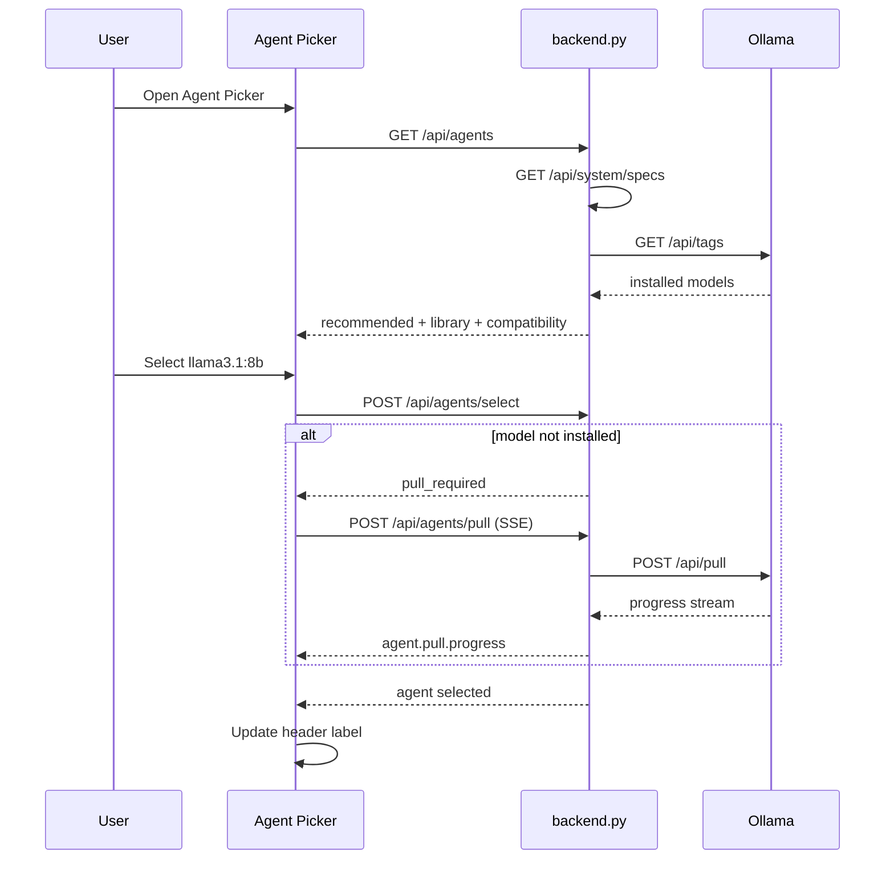
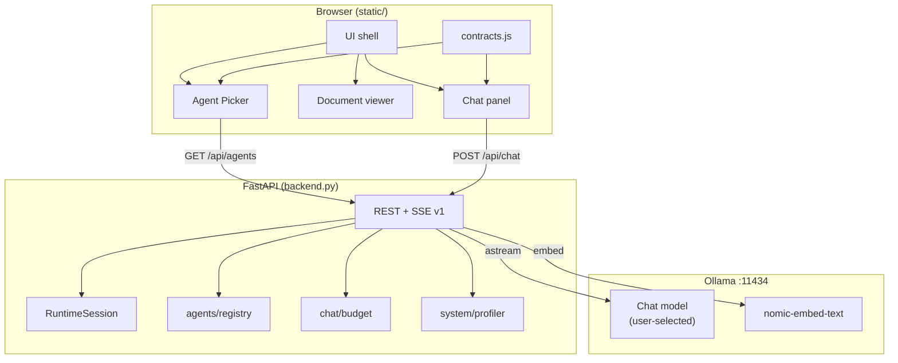
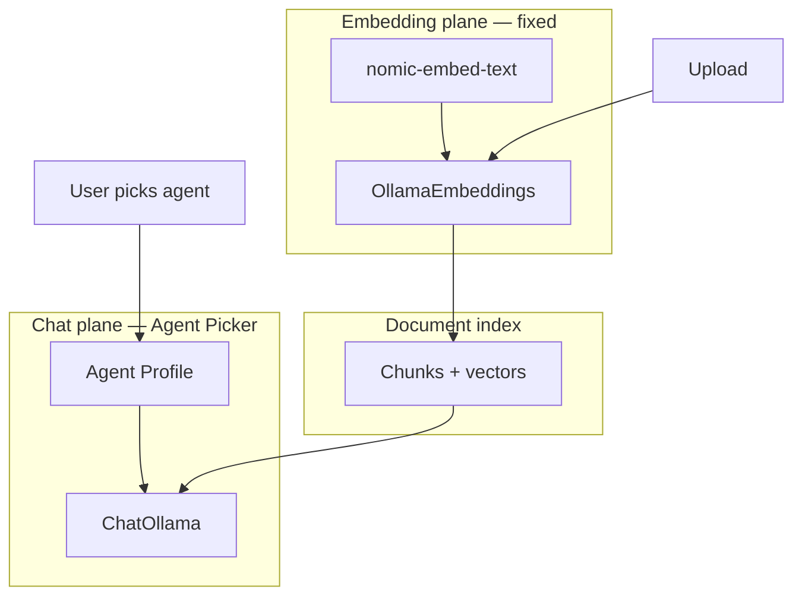
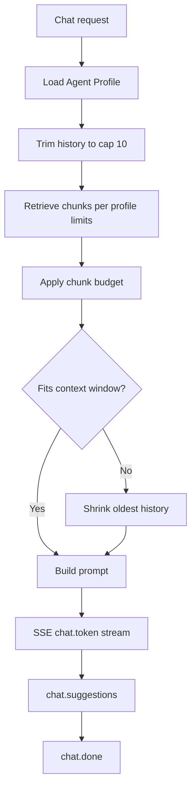
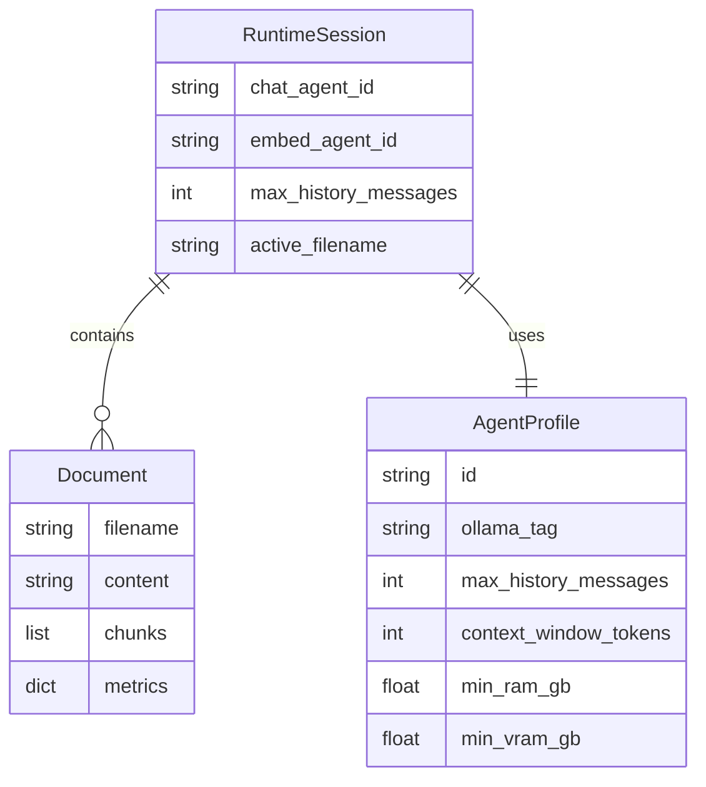
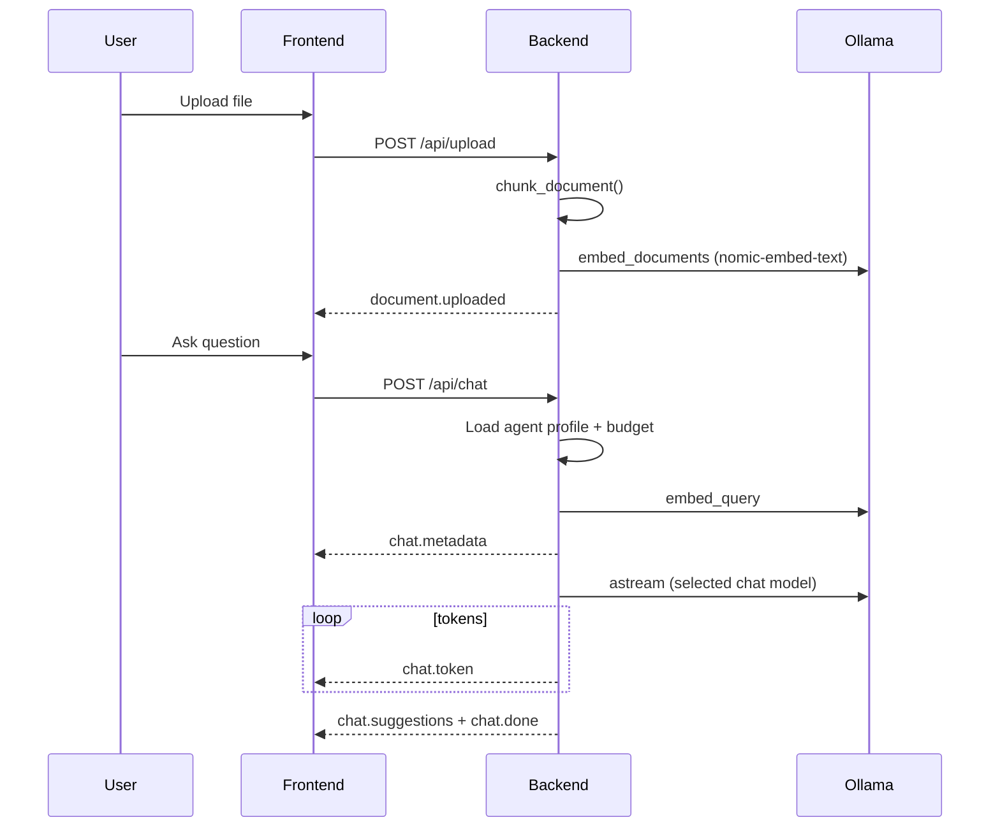
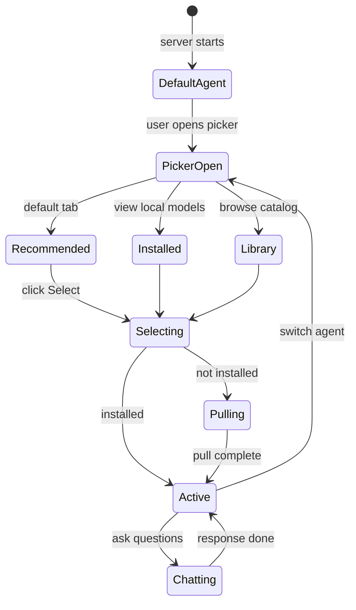
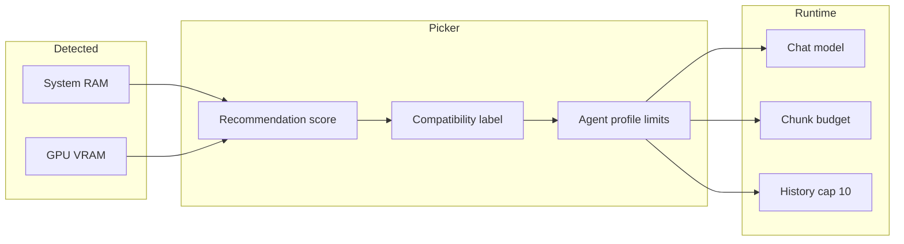
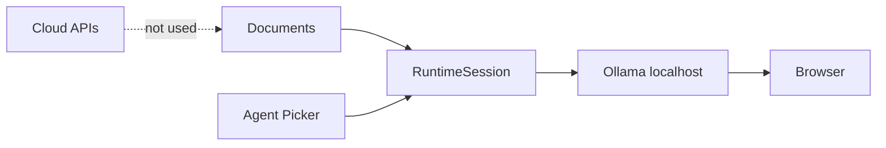

# Local-Cortex

Local document Q&A tool. Upload one or more files, ask questions, and get answers grounded in your documents with line-level citations. Inference runs through Ollama on your machine — no external API calls.

[](LICENSE)
[](https://www.python.org/)
[](https://fastapi.tiangolo.com/)

**Repo:** [Garvit-821/Local-ollama-powered-ai-assisted-doc-analyzer](https://github.com/Garvit-821/Local-ollama-powered-ai-assisted-doc-analyzer)

---

## Table of Contents

- [Overview](#overview)
- [Features](#features)
- [Agent Picker](#agent-picker)
- [JSON API Contract v1](#json-api-contract-v1)
- [Architecture](#architecture)
- [Tech Stack](#tech-stack)
- [Project Structure](#project-structure)
- [Setup and Installation](#setup-and-installation)
- [Usage](#usage)
- [Configuration](#configuration)
- [API Reference](#api-reference)
- [Interface Versions](#interface-versions)
- [Hardware Notes](#hardware-notes)
- [Privacy](#privacy)
- [Trade-offs and Limitations](#trade-offs-and-limitations)
- [Roadmap](#roadmap)
- [Contributing](#contributing)
- [Acknowledgments](#acknowledgments)
- [License](#license)

---

## Overview

Local-Cortex is a FastAPI + vanilla JS application for private document Q&A. The `feature/agent-picker` branch extends the multi-document web UI with a hardware-aware **Agent Picker**: choose an Ollama chat model matched to your system, browse a curated model library, pull missing models, and run inference without cloud APIs.

Documents are chunked with line traceability, embedded with a dedicated embedding model (`nomic-embed-text`), and retrieved via cosine similarity. The active **chat agent** (e.g. `qwen2.5:3b`, `llama3.1:8b`) is selected independently through the picker. Chat uses JSON schema v1 envelopes for REST and SSE, with a **10-message history cap** and per-agent context budgets.

| | |
|---|---|
| Inference | Ollama on `localhost:11434` |
| Chat model | User-selected via Agent Picker (default: `qwen2.5:3b`) |
| Embedding model | `nomic-embed-text` (fixed; fallback: `qwen2.5:3b`) |
| Retrieval | Ollama embeddings + cosine similarity |
| Multi-document | Up to 5 files per session |
| History cap | 10 messages (configurable per agent profile) |
| API format | JSON schema v1 (`schema_version: "1.0"`) |
| Target hardware | 8 GB RAM / 4 GB VRAM minimum for default agent |
| Persistence | None — state clears on server restart |

---

| | What it does |
|---|---|
| **Spatial Whiteboard** | Interactive 2D infinite canvas (mind map) with drag-and-drop nodes, manual sticky notes, interactive directional arrow connectors, and SVG bezier curves |
| **Hybrid Retrieval** | 60/40 blend of embedding vector similarity and TF-IDF keyword overlap with full-scan support |
| **Agent Picker** | Select chat model by hardware compatibility; Recommended / Installed / Library tabs |
| File upload | `.txt`, `.md`, `.pdf`, `.docx` via drag-and-drop or file browser |
| Multi-document | Load up to 5 files; tab bar, context banner, per-file delete |
| Retrieval | Hybrid search with per-agent chunk limits and full-scan abstract summaries |
| Comparison mode | Keywords like `compare`, `versus`, `both documents` trigger expanded per-file retrieval |
| Chat | SSE streaming (`chat.token`) with thinking/streaming session states |
| Citations | `filename: L12–45` badges; click to jump to cited lines |
| Follow-ups | Structured `chat.suggestions` events (2 questions per reply) |
| Search | Client-side filter over document lines (minimum 2 characters) |
| Export | Download full chat history as Markdown |
| Session reset | Clear button purges all documents and chat history |
| Telemetry | Active document, lines, words, session state, active agent label |

---

## Agent Picker

The Agent Picker lets you choose which Ollama model powers chat responses. It does **not** change the embedding model used for document indexing (see [Two-plane architecture](#two-plane-architecture)).

### UI

Open the picker from the **robot button** in the header (next to upload). The modal has three tabs:

| Tab | Contents |
|-----|----------|
| **Recommended** | Top models ranked by hardware fit + installation status |
| **Installed** | Models already available in local Ollama (`ollama list`) |
| **Library** | Full curated catalog from `agents/catalog.json` |

Each agent card shows: display name, tier, compatibility badge, RAM/VRAM requirements, history cap, install status, and **Select** or **Pull & Select**.

### Compatibility labels

| Label | Meaning |
|-------|---------|
| `compatible` | Meets RAM and VRAM requirements |
| `marginal` | Close to limits; may run slowly |
| `incompatible` | Below requirements; select button disabled |
| `unknown` | GPU VRAM could not be detected; RAM-only check applied |

### Recommendation scoring

Agents are ranked 0–100 using:

| Factor | Weight |
|--------|--------|
| Hardware fit (RAM/VRAM) | 45% |
| Already installed locally | 25% |
| Tier match (lightweight vs balanced) | 15% |
| Default model bonus (`qwen2.5:3b`) | 15% |

### Curated chat agents

| Agent | Tier | Min RAM | Min VRAM | History cap | Disk |
|-------|------|---------|----------|-------------|------|
| `qwen2.5:3b` | lightweight | 8 GB | 4 GB | 10 | ~2 GB |
| `gemma2:2b` | lightweight | 8 GB | 4 GB | 8 | ~1.6 GB |
| `phi3:mini` | lightweight | 8 GB | 4 GB | 10 | ~2.3 GB |
| `qwen2.5:7b` | balanced | 16 GB | 6 GB | 10 | ~4.7 GB |
| `llama3.1:8b` | balanced | 16 GB | 8 GB | 10 | ~4.9 GB |
| `mistral:7b` | balanced | 16 GB | 6 GB | 10 | ~4.4 GB |

Embedding model (not in picker UI): `nomic-embed-text` — used for all document indexing.

### Agent selection flow



### Agent switch rules

| Rule | Behavior |
|------|----------|
| During streaming | Picker blocked until response completes |
| Documents loaded | No re-index required (chat plane only) |
| Incompatible agent | Select disabled with reason |
| History trim | If new agent has smaller context, oldest messages dropped |

### Pull progress (SSE)

When a model is not installed, **Pull & Select** streams:

| Event `type` | Description |
|--------------|-------------|
| `agent.pull.progress` | Download percentage and status text |
| `agent.pull.done` | Pull completed |
| `agent.pull.error` | Pull failed |
| `agent.pull.selected` | Agent activated after successful pull |

---

## JSON API Contract v1

All REST responses and SSE events use a unified envelope:

```json
{
  "schema_version": "1.0",
  "type": "<domain>.<action>",
  "data": { },
  "error": null
}
```

On failure, `data` is `null` and `error` contains `code`, `message`, and optional `details`.

### Chat SSE events (v1)

| `type` | `data` fields | When sent |
|--------|---------------|-----------|
| `chat.metadata` | `agent_id`, `chunks`, `budget` | Before token stream |
| `chat.token` | `text` | During generation |
| `chat.suggestions` | `items` (array of 2 strings) | After answer completes |
| `chat.done` | `agent_id`, `answer_preview` | Stream finished |
| `chat.error` | — | Inference failure (`error` populated) |

### Context budget object

Included in `chat.metadata` to show how context was allocated:

| Field | Description |
|-------|-------------|
| `history_cap` | Max messages allowed for active agent |
| `history_used` | Messages sent in this request |
| `chunks_used` | Retrieved chunks sent to model |
| `max_total_chunks` | Agent profile limit |
| `estimated_prompt_tokens` | Rough token estimate |

---

## Architecture

### System overview (with Agent Picker)



### Two-plane architecture

Chat and embedding models are intentionally separated:



Switching the chat agent is immediate. Changing the embedding model requires `POST /api/agents/reindex` to re-embed all loaded documents.

### Context budget pipeline



### Session state



### Ingestion and chat pipelines



---

## Tech Stack

| Layer | Tool |
|-------|------|
| Backend | Python 3.10+, FastAPI, Uvicorn |
| Chat LLM | Ollama (user-selected via Agent Picker) |
| Embeddings | OllamaEmbeddings + `nomic-embed-text` |
| Agent catalog | `agents/catalog.json` + `agents/registry.py` |
| Hardware detection | `psutil` + `nvidia-smi` (optional) |
| HTTP client | `httpx` (Ollama tags + model pull) |
| Orchestration | LangChain (`langchain-ollama`, `langchain-core`) |
| Contracts | `schemas/v1.py` (Pydantic envelopes) |
| PDF | `pypdf` |
| DOCX | `python-docx` |
| Frontend | HTML, CSS, vanilla JS |
| API parsing | `static/contracts.js` |
| Agent UI | `static/agent-picker.js` |

Legacy entry points: `app.py` (CLI), `app_ui.py` (Streamlit).

---

## Project Structure

```
Local-ollama-powered-ai-assisted-doc-analyzer/
├── backend.py              # FastAPI app, routes, chat stream
├── session.py              # RuntimeSession (documents + agent state)
├── requirements.txt        # Python dependencies
├── schemas/
│   └── v1.py               # JSON v1 envelopes, AgentProfile models
├── agents/
│   ├── catalog.json        # Curated agent library
│   ├── registry.py         # Catalog + Ollama tags merge
│   ├── compatibility.py    # Hardware scoring
│   └── pull_jobs.py        # Model pull SSE proxy
├── system/
│   └── profiler.py         # RAM / VRAM / OS detection
├── chat/
│   └── budget.py           # History trim + context budget
├── static/
│   ├── index.html
│   ├── app.js
│   ├── agent-picker.js
│   ├── contracts.js
│   └── styles.css
├── app.py                  # CLI (legacy)
├── app_ui.py               # Streamlit (legacy)
├── DESIGN.md
├── LICENSE
└── README.md
```

---

## Setup and Installation

### Requirements

| | Minimum | Recommended |
|---|---|---|
| Python | 3.10 | 3.12 |
| RAM | 8 GB | 16 GB |
| GPU | Not required | NVIDIA 4 GB+ VRAM |
| Disk | ~4 GB free | Chat + embed models + venv |
| OS | Linux, macOS, Windows 10/11 | |

Install [Ollama](https://ollama.com) before using chat or the Agent Picker.

---

### Step 1 — Install Ollama

#### Linux / macOS

```bash
curl -fsSL https://ollama.com/install.sh | sh
```

#### Windows

Download from https://ollama.com/download and install.

```powershell
ollama --version
```

---

### Step 2 — Pull required models

```bash
ollama pull qwen2.5:3b
ollama pull nomic-embed-text
```

Optional — pull additional agents before using the picker, or use **Pull & Select** in the UI:

```bash
ollama pull llama3.1:8b
ollama pull mistral:7b
```

---

### Step 3 — Clone and checkout this branch

```bash
git clone https://github.com/Garvit-821/Local-ollama-powered-ai-assisted-doc-analyzer.git
cd Local-ollama-powered-ai-assisted-doc-analyzer

```

---

### Step 4 — Python environment

#### Windows (PowerShell)

```powershell
python -m venv venv
.\venv\Scripts\Activate.ps1
pip install langchain-community langchain-ollama langchain-core fastapi uvicorn python-multipart python-docx pypdf
```

#### Linux / macOS

```bash
python3 -m venv venv
source venv/bin/activate
pip install langchain-community langchain-ollama langchain-core fastapi uvicorn python-multipart python-docx pypdf

```

---

### Step 5 — Run

```bash
python -m uvicorn backend:app --host 127.0.0.1 --port 8000 --reload
```

Open http://127.0.0.1:8000

---

### Full install script (Windows PowerShell)

```powershell
ollama pull qwen2.5:3b
ollama pull nomic-embed-text

git clone https://github.com/Garvit-821/Local-ollama-powered-ai-assisted-doc-analyzer.git
cd Local-ollama-powered-ai-assisted-doc-analyzer


python -m venv venv
.\venv\Scripts\Activate.ps1
pip install langchain-community langchain-ollama langchain-core fastapi uvicorn python-multipart python-docx pypdf
python -m uvicorn backend:app --host 127.0.0.1 --port 8000 --reload
```

---

### Verify

```bash
curl http://localhost:11434/api/tags
curl http://127.0.0.1:8000/api/system/specs
curl http://127.0.0.1:8000/api/agents/current
```

---

### Troubleshooting

| Problem | Fix |
|---------|-----|
| Agent Picker empty | Start Ollama; check `ollama serve` |
| `INCOMPATIBLE_AGENT` | Choose a lighter model or upgrade RAM/VRAM |
| `pull_required` | Use Pull & Select or run `ollama pull <model>` |
| Upload embedding fails | Run `ollama pull nomic-embed-text` |
| Chat uses wrong model | Check header agent label; re-select in picker |
| History seems truncated | Cap is 10 messages; larger agents may trim further under budget |

---

## Usage

1. Start the server and open http://127.0.0.1:8000
2. Click the **robot button** in the header to open Agent Picker; confirm or change the active agent
3. Upload one or more documents
4. Ask questions in the chat panel
5. Click citation pills to jump to source lines
6. Use suggested follow-up buttons for the next question

### Agent Picker workflow



### Keyboard shortcuts

| Action | Key |
|--------|-----|
| Send message | Enter |
| New line | Shift + Enter |

---

## Configuration

Environment variables (optional):

| Variable | Default | Description |
|----------|---------|-------------|
| `CORTEX_DEFAULT_CHAT_MODEL` | `qwen2.5:3b` | Initial chat agent ID |
| `CORTEX_EMBED_MODEL` | `nomic-embed-text` | Embedding model |
| `CORTEX_HISTORY_LIMIT` | `10` | Global history message cap |
| `CORTEX_MAX_DOCUMENTS` | `5` | Max files per session |
| `OLLAMA_BASE_URL` | `http://localhost:11434` | Ollama endpoint |
| `CORTEX_CHUNK_SIZE` | `1000` | Chunk target size (chars) |
| `CORTEX_CHUNK_OVERLAP` | `200` | Chunk overlap (chars) |

Per-agent settings (temperature, `num_predict`, retrieval limits, history cap) live in `agents/catalog.json`.

---

## API Reference

Base URL: `http://127.0.0.1:8000`

All JSON responses use the [v1 envelope](#json-api-contract-v1).

### System and agents

| Method | Path | `type` | Description |
|--------|------|--------|-------------|
| GET | `/api/system/specs` | `system.specs` | RAM, VRAM, OS, Ollama status |
| GET | `/api/agents` | `agent.list` | Catalog + recommendations + installed |
| GET | `/api/agents/current` | `agent.current` | Active chat and embed agents |
| POST | `/api/agents/select` | `agent.select` | Switch chat agent |
| POST | `/api/agents/pull` | SSE | Download model from Ollama |
| GET | `/api/agents/pull/{job_id}` | `agent.pull.status` | Pull job status |
| POST | `/api/agents/reindex` | `agent.reindex` | Re-embed all documents |

### Documents

| Method | Path | `type` | Description |
|--------|------|--------|-------------|
| POST | `/api/upload` | `document.uploaded` | Upload and index file |
| GET | `/api/document` | `document.state` | Active document + list |
| POST | `/api/select` | `document.selected` | Set active document tab |
| POST | `/api/delete` | `document.deleted` | Remove one document |
| POST | `/api/clear` | `document.cleared` | Clear session |

### Chat

| Method | Path | Description |
|--------|------|-------------|
| POST | `/api/chat` | SSE stream (`chat.*` events) |

### Select agent request

```json
{
  "schema_version": "1.0",
  "agent_id": "llama3.1:8b"
}
```

### Select agent response (success)

```json
{
  "schema_version": "1.0",
  "type": "agent.select",
  "data": {
    "status": "ok",
    "chat_agent_id": "llama3.1:8b",
    "history_cap": 10
  },
  "error": null
}
```

### Select agent response (pull required)

```json
{
  "schema_version": "1.0",
  "type": "agent.select",
  "data": {
    "status": "pull_required",
    "agent_id": "llama3.1:8b",
    "ollama_tag": "llama3.1:8b"
  },
  "error": null
}
```

### Chat SSE example

```
data: {"schema_version":"1.0","type":"chat.metadata","data":{"agent_id":"qwen2.5:3b","chunks":[...],"budget":{"history_cap":10,"history_used":4,"chunks_used":6,"max_total_chunks":8,"estimated_prompt_tokens":3200}},"error":null}

data: {"schema_version":"1.0","type":"chat.token","data":{"text":"The"},"error":null}

data: {"schema_version":"1.0","type":"chat.suggestions","data":{"items":["What are the macros?","Compare both plans?"]},"error":null}

data: {"schema_version":"1.0","type":"chat.done","data":{"agent_id":"qwen2.5:3b"},"error":null}
```

---

## Interface Versions

| Version | Branch | Agent Picker | JSON v1 | Multi-doc |
|---------|--------|--------------|---------|-----------|
| v1 CLI | `main` | No | No | No |
| v2 Streamlit | — | No | No | No |
| v3 Web | `features` | No | No | Yes |
| **v4 Web + Picker** | **`feature/agent-picker`** | **Yes** | **Yes** | **Yes** |

| Branch | Description |
|--------|-------------|
| `feature/agent-picker` | Agent Picker, JSON v1, context budget, 10-msg history |
| `features` | Multi-document web UI (base) |
| `enhancements` | Retrieval and prompt hardening experiments |
| `user-interface` | Legacy single-doc TF-IDF UI |

---

## Hardware Notes



- Default agent `qwen2.5:3b` targets 8 GB RAM / 4 GB VRAM
- Balanced agents (`7b`/`8b`) need 16 GB RAM
- Embeddings use `nomic-embed-text` (~300 MB); computed once at upload
- Apple Silicon: unified memory used as VRAM proxy when `nvidia-smi` is unavailable

---

## Privacy



- All inference stays on your machine
- Agent selection stored in server memory only
- No authentication — bind to `127.0.0.1` for local use

---

## Trade-offs and Limitations

| Choice | Benefit | Cost |
|--------|---------|------|
| Separate chat / embed planes | Stable retrieval when switching chat models | Re-index required to change embed model |
| Curated catalog | Predictable compatibility metadata | Not every Ollama model listed |
| Server-side agent state | UI and backend stay in sync | Not multi-user |
| JSON v1 envelopes | Consistent parsing | Breaking change vs older branches |
| 10-message history cap | Bounded memory and context | Long threads lose early context |
| In-memory session | Simple deployment | Lost on server restart |

### Known limitations

1. GPU detection may be unavailable on some Windows setups; recommendations fall back to RAM-only.
2. Token budget estimation is approximate (character count / 4).
3. `app.py` and `app_ui.py` do not use Agent Picker or JSON v1.
4. Very large models on low-RAM systems may OOM even when marked marginal.

---

## Roadmap

- [x] Multiple documents per session
- [x] Export chat history
- [x] Line-level citations
- [x] Agent Picker with hardware compatibility
- [x] JSON API contract v1
- [x] Dedicated embedding model (`nomic-embed-text`)
- [x] 10-message history cap
- [x] Hybrid TF-IDF + embedding retrieval with full-scan mode
- [x] Spatial Whiteboard Mode (2D Mind Mapping Canvas)
- [x] Environment-variable UI for embed model + reindex flow
- [x] Docker setup
- [x] Automated tests for agent compatibility and budget
- [x] Mobile layout

---

## Contributing

1. Fork the repository
2. Branch from `feature/agent-picker`: `git checkout -b your-change`
3. Test Agent Picker, upload, and chat locally
4. Open a PR against `feature/agent-picker`

---

## Acknowledgments

- [Ollama](https://ollama.com) — local model runtime and library
- [LangChain](https://www.langchain.com/) — prompt orchestration
- [FastAPI](https://fastapi.tiangolo.com/) — API server
- [Nomic Embed](https://ollama.com/library/nomic-embed-text) — embedding model
- [Qwen2.5](https://huggingface.co/Qwen) — default chat model family 


---
## Contributors

Thank you to the following people who have contributed to this project:

- **[RUDRA-PRATAP-SINGH01](https://github.com/RUDRA-PRATAP-SINGH01)** — Major documentation rewrite, architecture mapping, and README overhaul.
## License

MIT License — see [LICENSE](LICENSE).
Project marked as Completed [x]
```
Copyright (c) 2026 Garvit Prakash
```

Issues: [GitHub Issues](https://github.com/Garvit-821/Local-ollama-powered-ai-assisted-doc-analyzer/issues)
