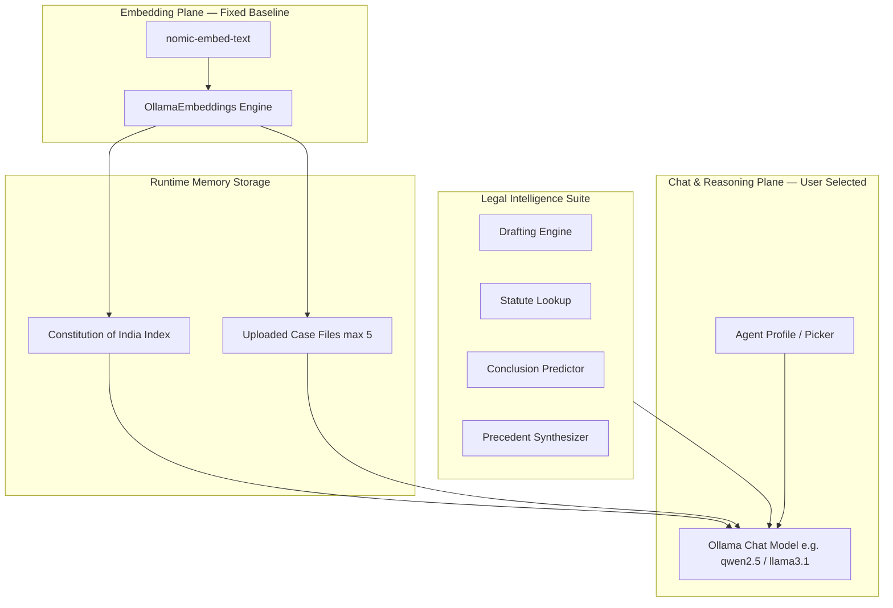

# Legal-Cortex — Private Legal Research & Intelligence Agent

Private, offline legal research, document Q&A, and automated drafting engine designed specifically for legal professionals operating under Indian Jurisprudence. Powered by local Ollama LLMs and vector retrieval — 100% on-device, with zero cloud API dependencies and complete client confidentiality.

[](LICENSE)
[](https://www.python.org/)
[](https://fastapi.tiangolo.com/)
[](https://ollama.com/)

**Repo:** [Garvit-821/Local-ollama-powered-ai-assisted-doc-analyzer](https://github.com/Garvit-821/Local-ollama-powered-ai-assisted-doc-analyzer)

---

## 🏛️ Table of Contents

- [Overview & Core Engine](#overview--core-engine)
- [Key Feature Modules](#key-feature-modules)
  - [🇮🇳 Constitution of India Auto-Ingestion](#-constitution-of-india-auto-ingestion)
  - [📜 Automated Legal Drafting Engine](#-automated-legal-drafting-engine)
  - [⚖️ Statute Intelligence Lookup](#-statute-intelligence-lookup)
  - [🔮 Predictive Conclusion & Risk Analysis](#-predictive-conclusion--risk-analysis)
  - [📚 Judicial Precedent Synthesis](#-judicial-precedent-synthesis)
  - [🤖 Hardware-Aware Agent Picker](#-hardware-aware-agent-picker)
  - [🗺️ Spatial Whiteboard Mind Map](#️-spatial-whiteboard-mind-map)
- [System Architecture](#system-architecture)
- [Tech Stack](#tech-stack)
- [API Reference & Legal Contracts](#api-reference--legal-contracts)
- [Setup and Installation](#setup-and-installation)
- [Usage Guide](#usage-guide)
- [Privacy & Confidentiality](#privacy--confidentiality)
- [License](#license)

---

## ⚖️ Overview & Core Engine

**Legal Cortex** converts raw local computing power into a private, high-speed legal research workstation. It is tailored to address the strict privacy requirements of law firms, advocates, and legal researchers. 

Unlike general-purpose document tools, Legal Cortex combines a pre-loaded knowledge base of Indian Constitutional law with specialized legal AI reasoning modules for automated pleading generation, statutory interpretation, litigation risk modeling, and case law analysis.

| Capability | Technical Implementation |
|---|---|
| **Inference Engine** | Local Ollama instance running on `localhost:11434` |
| **Active Chat LLM** | User-selectable via Agent Picker (default: `qwen2.5:3b`) |
| **Embedding Pipeline** | Fixed high-performance `nomic-embed-text` vector model |
| **Retrieval Architecture**| 60/40 Hybrid Blend (Cosine Vector Similarity + TF-IDF Keyword Match) |
| **Pre-Loaded Knowledge** | Background auto-ingestion of the complete **Constitution of India** |
| **Multi-Doc Context** | Simultaneous indexing and cross-referencing of up to 5 legal files |
| **Data Confidentiality** | 100% offline; zero external network transmissions or telemetry |

---

## 🚀 Key Feature Modules

### 🇮🇳 Constitution of India Auto-Ingestion
Upon launching the application server, Legal Cortex automatically detects and indexes the complete **Constitution of India** PDF located in `Data/Constituion Of India/`. 
- **Non-Blocking Background Pipeline**: Parsing and embedding run inside a dedicated background daemon thread, allowing the web server to start instantly while vector indexing finishes asynchronously.
- **Instant Constitutional Baseline**: Every chat session and statutory query possesses immediate context over fundamental rights (Articles 12–35), directive principles, and constitutional remedies (Articles 32 & 226).

---

### 📜 Automated Legal Drafting Engine
Generate standard, court-ready legal pleadings and contracts in seconds by filling out structured factual inputs. Located in the **Legal Intelligence Suite** modal.

#### Supported Templates:
1. **Bail Application (Sec. 437/439 CrPC)**: Generates formal petitions for Sessions/High Courts featuring prayer clauses, non-bailable offense defenses, and undertaking statements.
2. **Formal Legal Notice**: Drafts pre-litigation notices under Indian law detailing cause of action, monetary demands, statutory interest rates, and strict cure deadlines.
3. **Written Statement / Counter Reply**: Produces defense replies to civil suits containing preliminary objections, para-wise denials, and evidentiary affirmative defenses.
4. **Employment Contract**: Drafts comprehensive employment agreements under Indian Labor Law covering compensation (CTC), restrictive covenants, IP assignment, and termination notice periods.
5. **RTI Application (Sec. 6 RTI Act 2005)**: Creates structured Right to Information requests addressed to Public Information Officers (PIO) requesting certified files.

---

### ⚖️ Statute Intelligence Lookup
Search any Indian statute provision or Constitutional Article by number or title (e.g., *"Section 420 IPC"*, *"Article 21"*, *"Section 138 NI Act"*). The intelligence engine retrieves reference contexts and outputs a structured breakdown:
1. **Verbatim Text**: Exact statutory or constitutional wording.
2. **Plain-English Explanation**: Clear breakdown of what the provision means in practice.
3. **Key Legal Ingredients**: Essential elements required to satisfy the statutory threshold.
4. **Penalties & Application**: Applicable imprisonment terms, fines, or legal remedies.

---

### 🔮 Predictive Conclusion & Risk Analysis
Evaluates complex factual scenarios and evidentiary summaries to forecast potential litigation outcomes.
- **Likelihood of Success & Win Probability**: Gives a strategic risk assessment (High Risk, Balanced, Favorable).
- **Core Legal Strengths**: Identifies facts and statutory sections strongly supporting your client's position.
- **Critical Vulnerabilities**: Highlights evidentiary gaps, limitation period risks, or strong opposing counterarguments.
- **Strategic Next Steps**: Recommends actionable procedural remedies (e.g., injunctions, interim relief petitions).

---

### 📚 Judicial Precedent Synthesis
Synthesizes landmark judgments and ratio decidendi of the Supreme Court of India and State High Courts for any legal topic.
- **Landmark Rulings**: Cites foundational case citations and core judicial rulings.
- **Established Legal Doctrines**: Details applicable interpretation tests (e.g., doctrine of basic structure, severability, pith and substance).
- **Judicial Distinctions**: Explains how courts differentiate similar factual scenarios.

---

### 🤖 Hardware-Aware Agent Picker
Allows seamless switching of the active LLM powering chat and drafting without corrupting or requiring re-indexing of vector document embeddings.
- **Real-time Telemetry Bar**: Detects system hardware (RAM, VRAM, GPU presence) and ranks model compatibility (`compatible`, `marginal`, `incompatible`).
- **One-Click Model Pulling**: Integrated SSE streaming loader to download new Ollama models (`llama3.1:8b`, `mistral:7b`, `phi3:mini`) directly from the library modal.

---

### 🗺️ Spatial Whiteboard Mind Map
Switch from split-screen cockpit view to an interactive 2D infinite canvas:
- Drag-and-drop research nodes representing key document sections.
- Add manual sticky notes for custom case notes.
- Connect research nodes and sticky notes using directional interactive arrow connectors and bezier curves for visual case building.

---

## 🏗️ System Architecture

### Two-Plane Decoupled Architecture



---

## 🛠️ Tech Stack

| Component | Technology |
|---|---|
| **Core Web Framework** | Python 3.10+, FastAPI, Uvicorn |
| **Local LLM Orchestration** | LangChain (`langchain-ollama`, `langchain-core`) |
| **Local Vector Embeddings** | `nomic-embed-text` via Ollama |
| **PDF & Document Parsing** | `pypdf`, `python-docx` |
| **Hardware Inspection** | `psutil`, `nvidia-smi` |
| **Frontend UI** | Modern Vanilla JavaScript (ES6+), HTML5, Vanilla CSS3 (Design Tokens) |
| **Icons & Typography** | FontAwesome 6 Pro/Free, Inter & JetBrains Mono Fonts |

---

## 📡 API Reference & Legal Contracts

Legal Cortex exposes standardized REST endpoints and EventSource (SSE) streams under JSON API Contract v1.

### Legal Suite Endpoints

#### 1. Generate Legal Draft
- **Endpoint**: `POST /api/legal/draft`
- **Payload**:
```json
{
  "template_type": "bail_application",
  "facts": {
    "applicant_name": "Ramesh Kumar",
    "court_name": "In the Court of Sessions Judge, Saket",
    "fir_details": "FIR No. 204/2024, PS Hauz Khas",
    "sections": "Sec 420, 468 IPC",
    "grounds": "False implication due to commercial rivalry. Willing to cooperate with investigation."
  }
}
```

#### 2. Statute Lookup
- **Endpoint**: `POST /api/legal/statute`
- **Payload**: `{ "query": "Section 420 IPC" }`

#### 3. Conclusion Prediction
- **Endpoint**: `POST /api/legal/predict`
- **Payload**: `{ "facts": "Detailed summary of dispute, breach of contract claims, and evidence..." }`

#### 4. Precedent Analysis
- **Endpoint**: `POST /api/legal/precedents`
- **Payload**: `{ "issue": "Right to privacy under Article 21 and digital data collection" }`

---

## 💻 Setup and Installation

### Prerequisites
1. **Python 3.10+** installed.
2. **Ollama** installed and running on your system ([ollama.com](https://ollama.com)).

### Step 1: Install & Start Ollama
```bash
# Pull essential base models
ollama pull qwen2.5:3b
ollama pull nomic-embed-text
```

### Step 2: Clone Repository & Virtual Environment
```bash
git clone https://github.com/Garvit-821/Local-ollama-powered-ai-assisted-doc-analyzer.git
cd Local-ollama-powered-ai-assisted-doc-analyzer

# Create virtual environment
python3 -m venv venv
source venv/bin/activate
```

### Step 3: Install Dependencies
```bash
pip install -r requirements.txt
```
*(Dependencies: `fastapi`, `uvicorn`, `langchain-ollama`, `langchain-core`, `langchain-community`, `pypdf`, `python-docx`, `psutil`)*

### Step 4: Run Application
```bash
python3 backend.py
# or
python3 -m uvicorn backend:app --host 127.0.0.1 --port 8000 --reload
```

Open your browser and navigate to **`http://127.0.0.1:8000`**.

---

## 🛡️ Privacy & Confidentiality

Legal Cortex was designed from the ground up to guarantee strict advocate-client privilege:
- **Zero Cloud Leakage**: No prompts, uploaded petitions, or case notes ever leave your local machine.
- **Air-Gapped Friendly**: Once Ollama models are pulled, Legal Cortex operates entirely offline without internet connectivity.
- **In-Memory Volatility**: Document vectors and active chat histories reside purely in server memory and clear upon session reset or server restart.

---

## 📄 License

Distributed under the MIT License. See `LICENSE` for more information.
