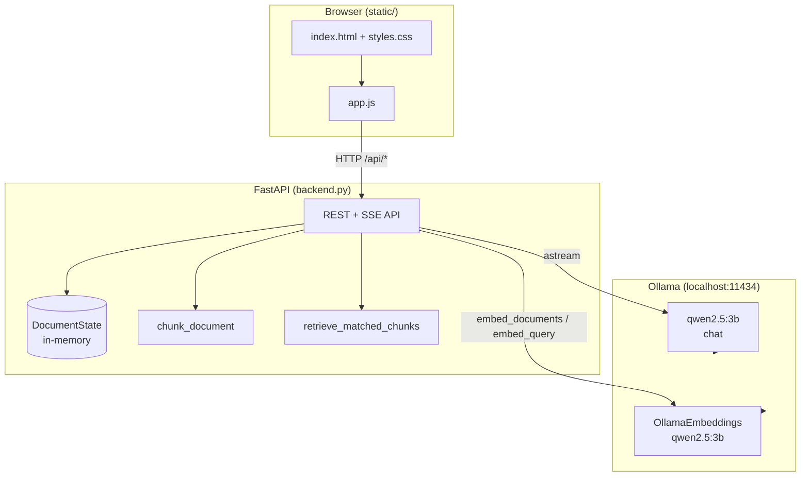
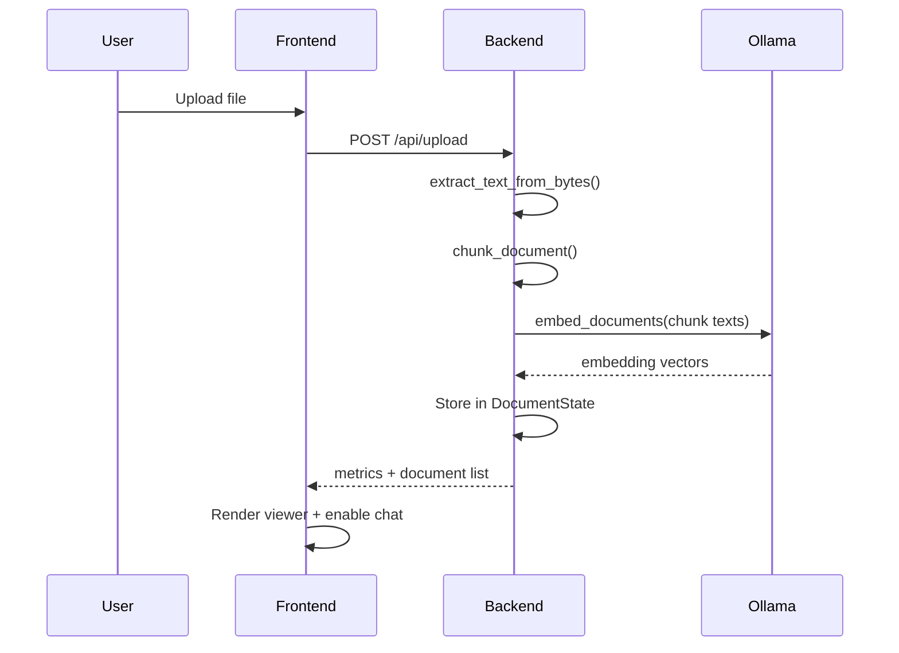
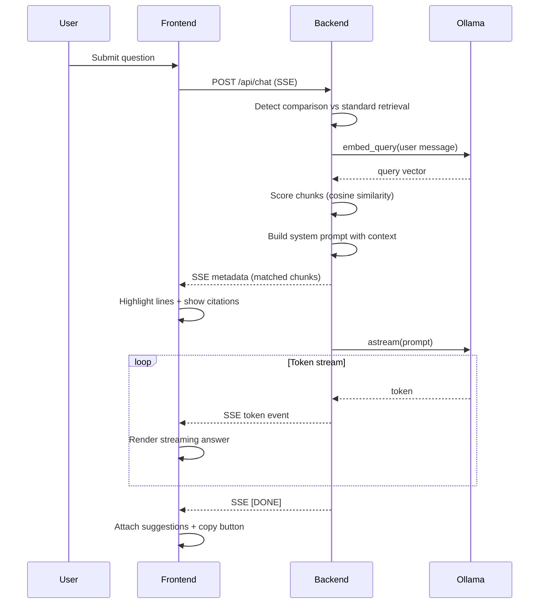
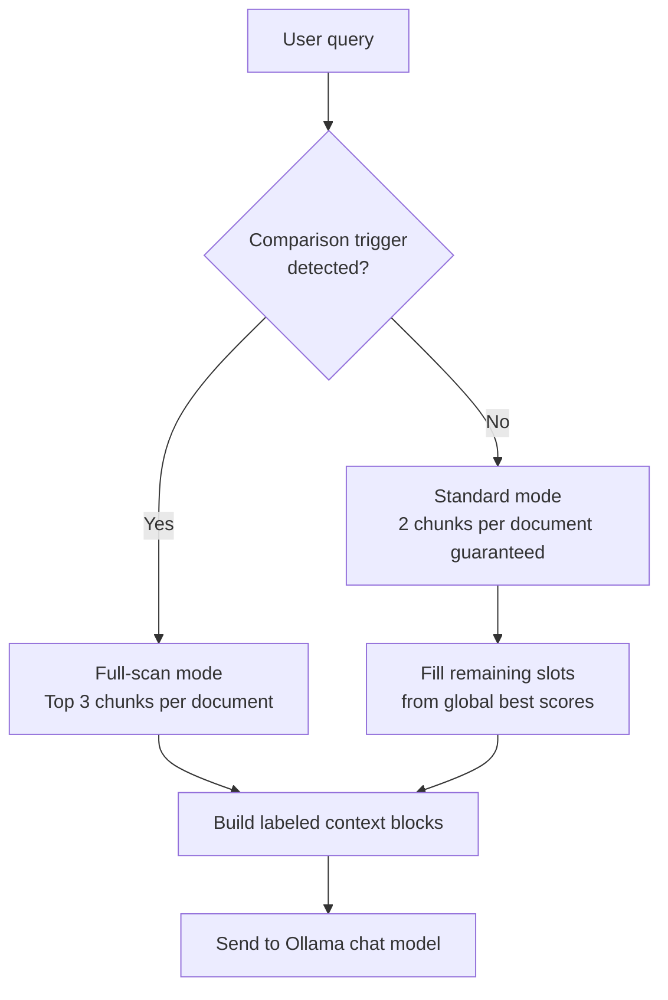
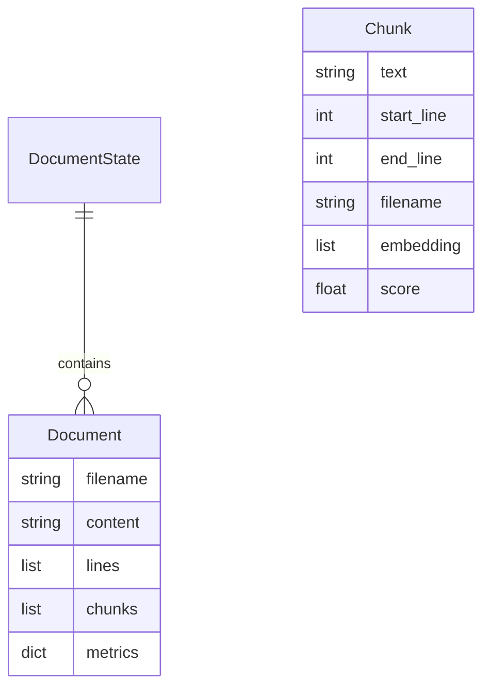

# Local-Cortex

Local-Cortex is a document question-answering application that runs entirely on your machine. Upload one or more documents, ask questions in natural language, and receive answers grounded in the uploaded content with line-level source citations. All inference is performed through [Ollama](https://ollama.com); no external API keys or cloud services are required.

The primary interface is a split-screen web application: a document viewer on the left and a streaming chat agent on the right. A FastAPI backend handles ingestion, retrieval, and generation. Legacy entry points (`app.py` CLI and `app_ui.py` Streamlit) are included for simpler or alternative workflows.

---

## Quick Start

### Prerequisites

| Requirement | Minimum |
|-------------|---------|
| Python | 3.10 or later |
| Ollama | Latest stable release |
| RAM | 8 GB (16 GB recommended for larger models) |
| Disk | ~3 GB free (model weights) |

### 1. Install Ollama and pull models

#### Windows

```powershell
# Install from https://ollama.com/download/windows, then:
ollama pull qwen2.5:3b
ollama serve
```

#### macOS

```bash
# Install from https://ollama.com/download/mac, or:
brew install ollama
ollama pull qwen2.5:3b
ollama serve
```

#### Linux

```bash
curl -fsSL https://ollama.com/install.sh | sh
ollama pull qwen2.5:3b
ollama serve
```

Verify Ollama is running:

```bash
ollama list
curl http://localhost:11434/api/tags
```

### 2. Clone and set up the project

#### Windows (PowerShell)

```powershell
git clone https://github.com/Garvit-821/Local-ollama-powered-ai-assisted-doc-analyzer.git
cd Local-ollama-powered-ai-assisted-doc-analyzer
git checkout features

python -m venv venv
.\venv\Scripts\Activate.ps1
pip install fastapi uvicorn langchain-ollama langchain-core pydantic python-docx pypdf
```

#### macOS / Linux

```bash
git clone https://github.com/Garvit-821/Local-ollama-powered-ai-assisted-doc-analyzer.git
cd Local-ollama-powered-ai-assisted-doc-analyzer
git checkout features

python3 -m venv venv
source venv/bin/activate
pip install fastapi uvicorn langchain-ollama langchain-core pydantic python-docx pypdf
```

### 3. Run the application

```bash
# With virtual environment activated
python -m uvicorn backend:app --host 127.0.0.1 --port 8000 --reload
```

Open **http://127.0.0.1:8000** in your browser.

### 4. Optional: alternative interfaces

**Terminal CLI** (single document, no web UI):

```bash
python app.py
```

Edit `TARGET_DOC` in `app.py` to point at your file (default: `sample_doc.txt`).

**Streamlit UI** (single document):

```bash
pip install streamlit
streamlit run app_ui.py
```

---

## Features

### Document ingestion

- Supported formats: `.pdf`, `.docx`, `.md`, `.markdown`, `.txt`
- Drag-and-drop or file browser upload
- Text extraction via `pypdf` (PDF) and `python-docx` (Word)
- Line-preserving chunking (~1000 characters per chunk, 200-character overlap)
- Per-chunk embedding generation through Ollama at upload time
- Document metrics: character count, word count, line count, chunk count

### Multi-document sessions

- Up to **5 documents** loaded simultaneously
- Tab bar to switch the active document in the viewer
- Context banner listing all files currently in agent memory
- Per-tab delete with confirmation
- Chat retrieval spans **all** loaded documents, not only the active tab

### Retrieval and grounding

- Query embedding compared against all chunk embeddings via cosine similarity
- **Standard mode**: guarantees 2 top-scoring chunks per document, then fills remaining slots globally (minimum 6 chunks total)
- **Comparison mode**: triggered by keywords such as `compare`, `versus`, `differentiate`, `summarize all`, `both documents`; retrieves top 3 chunks per file to avoid missing cross-document context
- Retrieved chunks are injected into the system prompt with explicit file name and line range labels

### Chat interface

- Server-Sent Events (SSE) token streaming
- Line highlighting in the document viewer when citations are returned
- Clickable citation pills (`filename: L12–45`) that jump to the cited lines
- In-document text search (minimum 2 characters)
- Follow-up suggestion buttons parsed from model output
- Copy-to-clipboard on assistant messages
- Export full chat history as Markdown
- Session purge (clears all documents and chat history)

### Telemetry bar

Real-time display of active document name, parsed line count, word count, and session state (Idle, Thinking, Streaming, Active, Error).

---

## Architecture

### High-level system diagram



### Component responsibilities

| Component | File | Role |
|-----------|------|------|
| Web UI | `static/index.html`, `static/styles.css`, `static/app.js` | Split-screen cockpit, upload modal, chat, citations |
| API server | `backend.py` | Upload, retrieval, chat streaming, static file hosting |
| CLI | `app.py` | Terminal-based single-document chat |
| Streamlit UI | `app_ui.py` | Alternative browser UI via Streamlit |
| Design tokens | `DESIGN.md` | UI color and typography reference (not loaded at runtime) |

### Ingestion pipeline



### Chat and retrieval pipeline



### Multi-document retrieval logic



### Data model (in-memory)



`DocumentState` is a module-level singleton. Restarting the server clears all uploaded documents.

---

## API Reference

| Method | Endpoint | Description |
|--------|----------|-------------|
| `POST` | `/api/upload` | Upload and process a document (multipart form, field: `file`) |
| `GET` | `/api/document` | Return active document content, metrics, and document list |
| `POST` | `/api/select` | Set active document (`{"filename": "..."}`) |
| `POST` | `/api/delete` | Remove a document from memory |
| `POST` | `/api/clear` | Clear all documents and reset state |
| `POST` | `/api/chat` | Stream a chat response (SSE); body: `{"message": "...", "history": [...]}` |

### Chat SSE event types

| Event `type` | Payload | When sent |
|--------------|---------|-----------|
| `metadata` | `{ chunks: [...] }` | Before token stream; used for citations and highlighting |
| `token` | `{ text: "..." }` | During generation |
| `error` | `{ detail: "..." }` | On inference failure |
| `[DONE]` | — | Stream complete |

---

## Configuration

The `features` branch uses hardcoded defaults in `backend.py`:

| Setting | Default | Location |
|---------|---------|----------|
| Chat model | `qwen2.5:3b` | `ChatOllama(model=...)` |
| Embedding model | `qwen2.5:3b` | `OllamaEmbeddings(model=...)` |
| Temperature | `0.3` | `ChatOllama` |
| Max output tokens | `768` | `num_predict` |
| Max documents | `5` | Upload validation |
| Chunk size | `1000` chars | `chunk_document()` |
| Chunk overlap | `200` chars | `chunk_document()` |
| Chat history window | `6` messages | `/api/chat` |

Ollama base URL defaults to `http://localhost:11434`.

---

## Project structure

```
Local-ollama-powered-ai-assisted-doc-analyzer/
├── backend.py          # FastAPI server, retrieval, chat, document processing
├── app.py              # CLI chatbot (single file)
├── app_ui.py           # Streamlit alternative UI
├── static/
│   ├── index.html      # Main web interface
│   ├── styles.css      # Layout and visual design
│   └── app.js          # Client logic, SSE, UI state
├── DESIGN.md           # Design system reference
├── sample_doc.txt      # Sample file for CLI demo
├── test_pricing.txt    # Sample pricing document
├── test_sample.md      # Sample markdown file
├── test_sample.docx    # Sample Word document
├── LICENSE             # MIT License
└── README.md
```

---

## Design and UX

The web interface uses a dark cockpit layout with a split panel:

- **Left panel**: line-numbered document viewer with search, scroll-to-top, and tab navigation
- **Right panel**: Cortex agent chat with streaming responses, citation pills, and suggestion chips
- **Upload modal**: drag-and-drop zone with staged ingestion progress

Visual tokens (colors, typography scale, spacing) are documented in `DESIGN.md`. The runtime UI uses Inter and JetBrains Mono via Google Fonts.

---

## Trade-offs and limitations

### Deliberate design choices

| Choice | Benefit | Cost |
|--------|---------|------|
| In-memory `DocumentState` | Simple, fast, no database setup | All data lost on server restart; not multi-user |
| Local Ollama inference | Privacy, no API cost, offline-capable | Quality and speed depend on local hardware |
| Line-based chunking | Precise citations (line ranges) | Chunks may split semantic units awkwardly |
| Embedding at upload time | Faster query latency | Longer initial upload for large files |
| SSE streaming | Responsive UI during generation | More complex client parsing than REST |
| Vanilla JS frontend | No build step, easy to deploy | No component framework or type checking |

### Known limitations

1. **Embedding model**: The `features` branch uses `qwen2.5:3b` for both chat and embeddings. Dedicated embedding models (e.g. `nomic-embed-text`) typically produce better retrieval quality.
2. **Model size**: `qwen2.5:3b` is lightweight but may produce shallow or incorrect answers on complex multi-document comparisons.
3. **PDF extraction**: Text quality depends on PDF structure; scanned images without OCR are not supported.
4. **No persistence**: Uploaded files and chat history are not saved to disk by the backend.
5. **No authentication**: The server binds to localhost by default but exposes open CORS; do not expose untrusted networks without additional hardening.
6. **Single process**: Concurrent uploads and chats share one in-memory state; not suitable for production multi-tenant deployment without architectural changes.
7. **Prompt instructions in output**: Suggestion formatting instructions are duplicated in the system and human prompts; the model may occasionally echo them (the frontend strips most suggestion lines from the visible answer).
8. **TF-IDF class unused**: `SimpleTFIDF` is defined in `backend.py` on this branch but is not wired into the retrieval path; retrieval is embedding-only.

### When to use which interface

| Interface | Best for |
|-----------|----------|
| Web UI (`backend.py` + `static/`) | Full feature set: multi-doc, citations, streaming, export |
| Streamlit (`app_ui.py`) | Quick single-file prototyping |
| CLI (`app.py`) | Scripting, terminal-only environments, minimal dependencies |

---

## Troubleshooting

| Symptom | Likely cause | Fix |
|---------|--------------|-----|
| `Inference failed — check Ollama is running` | Ollama not started or model missing | Run `ollama serve` and `ollama pull qwen2.5:3b` |
| Port 8000 already in use | Another process on that port | Stop the other process or use `--port 8001` |
| Empty or garbled PDF text | PDF is image-based or encrypted | Use a text-based PDF or OCR preprocessing |
| Slow first response | Cold model load | Wait for Ollama to load weights; consider a smaller model |
| Upload fails at 5 files | Document limit reached | Delete a tab before uploading another file |

---

## Development

Run with auto-reload during development:

```bash
python -m uvicorn backend:app --host 127.0.0.1 --port 8000 --reload
```

Static assets are served from `static/` at the root path. API routes are registered before the static mount to avoid routing conflicts.

---

## License

This project is licensed under the MIT License. See [LICENSE](LICENSE) for the full text.

```
MIT License

Copyright (c) 2026 Garvit-821 and contributors

Permission is hereby granted, free of charge, to any person obtaining a copy
of this software and associated documentation files (the "Software"), to deal
in the Software without restriction, including without limitation the rights
to use, copy, modify, merge, publish, distribute, sublicense, and/or sell
copies of the Software, and to permit persons to whom the Software is
furnished to do so, subject to the following conditions:

The above copyright notice and this permission notice shall be included in all
copies or substantial portions of the Software.

THE SOFTWARE IS PROVIDED "AS IS", WITHOUT WARRANTY OF ANY KIND, EXPRESS OR
IMPLIED, INCLUDING BUT NOT LIMITED TO THE WARRANTIES OF MERCHANTABILITY,
FITNESS FOR A PARTICULAR PURPOSE AND NONINFRINGEMENT. IN NO EVENT SHALL THE
AUTHORS OR COPYRIGHT HOLDERS BE LIABLE FOR ANY CLAIM, DAMAGES OR OTHER
LIABILITY, WHETHER IN AN ACTION OF CONTRACT, TORT OR OTHERWISE, ARISING FROM,
OUT OF OR IN CONNECTION WITH THE SOFTWARE OR THE USE OR OTHER DEALINGS IN THE
SOFTWARE.
```
